# Metodologi Digital Electability Score (DES) Katapedia

Dokumen ini menjelaskan kerangka kerja teoritis, formula perhitungan, skala penilaian, dan mekanisme pembentukan roadmap berbasis metodologi **Digital Electability Score (DES)** yang dikembangkan oleh Katapedia.

**Rujukan Utama:**
- `Katapedia's Way #9 - DES: Cara Meningkatkan Elektabilitas Digital Menuju 2029` oleh Deddy Rahman ([DES-KW])
- `FRD DED — Digital Electability Dashboard PoC/MVP` ([FRD])

---

## 1. Filosofi & Kerangka Kerja DES

> *"Ketika pemilih mencari, mengenal, dan mempertimbangkan Anda — sejauh mana kehadiran digital Anda benar-benar mendukung itu?"*  
> *(Katapedia's Way #9 - DES, Hal. 6)*

### 1.1 Bukan Sekadar Popularitas
DES membedakan dengan tegas antara **angka follower semata** dengan **kekuatan elektoral nyata**. Akun dengan puluhan ribu follower pasif atau hasil beli tidak memiliki daya konversi elektoral. Yang diukur adalah keseluruhan jejak digital kandidat:
1. **Mudah Ditemukan** saat dicari pemilih
2. **Dikenal & Dipahami** diferensiasi pesannya
3. **Dipercaya** integritas dan rekam jejaknya
4. **Menghasilkan Tindakan Nyata** (percakapan, komunitas, pendaftaran relawan, dan suara).

### 1.2 Berjenjang: 10 Dimensi Digital Electoral Journey
DES mengukur kekuatan kandidat melalui 10 langkah perjalanan bertahap (*Digital Electoral Journey*):

```mermaid
flowchart LR
    D01["01. Terlihat\n(Visibility)"] --> D02["02. Dikenal\n(Positioning)"]
    D02 --> D03["03. Memiliki Isu\n(Issue Ownership)"]
    D03 --> D04["04. Memiliki Cerita\n(Winning Narrative)"]
    D04 --> D05["05. Menghasilkan Perhatian\n(Content Power)"]
    D05 --> D06["06. Terhubung Audiens\n(Audience Connection)"]
    D06 --> D07["07. Dipercaya\n(Trust & Reputation)"]
    D07 --> D08["08. Menjangkau Lebih Luas\n(Algorithmic Reach)"]
    D08 --> D09["09. Menghasilkan Dukungan\n(Electoral Conversion)"]
    D09 --> D10["10. Menjadi Sistem\n(Intelligence Engine)"]
```

---

## 2. Penjelasan 10 Dimensi DES

### D01 — Digital Visibility (*Be Seen*)
- **Pertanyaan Reflektif:** *"Kalau orang yang belum mengenal saya mencari nama saya hari ini, seberapa mudah mereka menemukan dan memahami siapa saya?"* ([DES-KW] Hal. 11)
- **Yang Diukur:** Kemudahan ditemukan di mesin pencari & media sosial, keberadaan akun aktif di platform utama (Instagram, TikTok), konsistensi publikasi, dan kualitas digital footprint.
- **Implementasi MVP:**
  - Auto-measured: Frekuensi posting 30 hari terakhir, kelengkapan profil (bio, link, foto resmi), indeks ketercakupan akun.

### D02 — Political Positioning (*Be Known*)
- **Pertanyaan Reflektif:** *"Ketika nama saya disebut, apa satu hal yang ingin langsung diingat oleh pemilih?"* ([DES-KW] Hal. 12)
- **Yang Diukur:** Kejelasan identitas kandidat, diferensiasi dari kandidat lain di dapil yang sama, fokus dan konsistensi pesan utama.
- **Implementasi MVP:**
  - AI-assessed: Ekstraksi frasa positioning, konsistensi tagar/pesan kunci, rasio pesan terfokus vs pesan acak/seremonial.

### D03 — Issue Ownership (*Be Associated*)
- **Pertanyaan Reflektif:** *"Isu apa yang ketika dibicarakan membuat orang mulai mengingat nama saya?"* ([DES-KW] Hal. 13)
- **Yang Diukur:** Kekuatan asosiasi kandidat dengan isu spesifik (mis. UMKM digital, pendidikan vokasi, pupuk petani), konsistensi advokasi, otoritas dalam topik tersebut.
- **Implementasi MVP:**
  - AI-assessed: Clustering topik konten, frekuensi isu dominan, asosiasi dalam komentar audiens.

### D04 — Winning Narrative (*Be Remembered*)
- **Pertanyaan Reflektif:** *"Kalau pemilih hanya mengingat satu cerita tentang saya, cerita apa yang saya ingin mereka ingat?"* ([DES-KW] Hal. 14)
- **Yang Diukur:** Struktur storytelling "mengapa saya maju", relevansi latar belakang pribadi dengan perjuangan masyarakat, resonansi emosional narasi.
- **Implementasi MVP:**
  - AI-assessed: Deteksi elemen narasi personal (*origin story*, *struggle*, *vision*), sentimen emosional cerita.

### D05 — Content Power & Winning Formula (*Be Attention-Worthy*)
- **Pertanyaan Reflektif:** *"Apakah saya tahu konten mana yang benar-benar bekerja, mengapa, dan bagaimana membuat versi berikutnya?"* ([DES-KW] Hal. 15)
- **Yang Diukur:** Kinerja konten relatif terhadap baseline kandidat, kemampuan mengidentifikasi hook dan format dengan views 3x–5x lipat rata-rata.
- **Implementasi MVP:**
  - Auto-measured & Baseline: Perbandingan rasio views & engagement konten terhadap personal median, penandaan *Winning Content Formula*.

### D06 — Audience Connection (*Be Connected*)
- **Pertanyaan Reflektif:** *"Apakah orang hanya menonton saya, atau mereka mulai berbicara dengan saya?"* ([DES-KW] Hal. 17)
- **Yang Diukur:** Kualitas interaksi dua arah di kolom komentar, kecepatan dan personalisasi balasan kandidat, terbentuknya komunitas aktif.
- **Implementasi MVP:**
  - Auto-measured: Komentar per 1.000 views, rasio komentar terhadap likes.
  - AI-assessed: Klasifikasi komentar substantif vs spam/emotikon saja.

### D07 — Digital Trust & Reputation (*Be Trusted*)
- **Pertanyaan Reflektif:** *"Kalau orang semakin sering melihat saya, apakah mereka semakin percaya kepada saya?"* ([DES-KW] Hal. 18)
- **Yang Diukur:** Konsistensi karakter, keterbukaan bukti atas klaim (transparansi program), kesiapan merespons isu negatif/serangan kampanye hitam.
- **Implementasi MVP:**
  - AI-assessed: Sentimen netto audiens (positif vs negatif), pendeteksian isu sensitif, bukti (*evidence snippet*) atas serangan reputasi.

### D08 — Algorithmic Reach (*Be Discovered by More*)
- **Pertanyaan Reflektif:** *"Apakah konten saya mampu menemukan orang yang belum mengenal saya?"* ([DES-KW] Hal. 19)
- **Yang Diukur:** Proporsi jangkauan di luar basis follower (FYP TikTok / Reels Instagram Explore), kemampuan konten menyebar secara organik (*travel*).
- **Implementasi MVP:**
  - Auto-measured: Rasio views terhadap total followers (views/follower multiplier).

### D09 — Electoral Conversion (*Be Chosen*)
- **Pertanyaan Reflektif:** *"Apakah orang yang melihat saya akhirnya melakukan sesuatu karena terpengaruh kehadiran digital saya?"* ([DES-KW] Hal. 20)
- **Yang Diukur:** Konversi corong elektoral (Viewer -> Follower -> Engaged -> Community -> Supporter/Advocate terdaftar).
- **Implementasi MVP:**
  - Out of scope pengukuran otomatis langsung (FRD Hal. 4), diukur melalui proxy interaksi aksi nyata, tautan bio relawan, dan self-assessment kandidat.

### D10 — Digital Intelligence & Winning Content Engine (*Be Repeatable*)
- **Pertanyaan Reflektif:** *"Apakah saya sudah memiliki mesin yang bisa belajar dari data, menemukan winning content, mengulanginya, dan memperbesarnya?"* ([DES-KW] Hal. 21)
- **Yang Diukur:** Keberadaan dashboard analitik berkala, SOP produksi tim kreatif, alur eksperimentasi teratur, kemampuan delegasi tanpa kandidat harus turun tangan langsung dalam setiap teknis.
- **Implementasi MVP:**
  - Penilaian kesiapan operasional tim digital, konsistensi ritme publikasi mingguan, dokumentasi pola konten pemenang.

---

## 3. Skala Penilaian Level 1–5

Sesuai panduan penilaian pada **[DES-KW] Halaman 24**:

| Level | Kategori Kesiapan | Karakteristik Bukti Lapangan | Interpretasi Strategis |
| :---: | :--- | :--- | :--- |
| **1** | **Kosong / Kritis** | Tidak ditemukan saat dicari; jejak digital kosong, terbengkalai, atau tidak relevan. | Sangat rentan; tidak memiliki fondasi digital di dapil. |
| **2** | **Usang / Terpecah** | Ditemukan sebagian; informasi tidak konsisten, profil ganda lama, atau sudah berbulan-bulan tidak update. | Membingungkan pemilih; perlu audit dan konsolidasi segera. |
| **3** | **Cukup / Standar** | Ditemukan di platform utama; informasi dan identitas cukup jelas, namun performa masih fluktuatif. | Memiliki kehadiran standar; perlu diferensiasi & peningkatan engagement. |
| **4** | **Kuat / Konsisten** | Mudah ditemukan; informasi konsisten di banyak kanal, isu fokus, interaksi dua arah aktif. | Memiliki daya tarik elektoral digital yang solid; siap ditingkatkan jangkauannya. |
| **5** | **Sistemik / Unggul** | Sangat mudah ditemukan; jejak digital kuat dan konsisten, memiliki formula konten berulang, didukung sistem tim. | Kekuatan digital dominan; siap menggerakkan konversi pemilih dan relawan. |

---

## 4. Mesin Personal Baseline (Baseline Engine)

Mengikuti ketentuan **FRD Bagian 11.6 (Hal. 6)**:
1. **Perhitungan Mandiri (*Self-Baseline*):**
   - Baseline dihitung per kandidat, per platform, dan per rentang waktu (30, 90, 180 hari).
   - Metrik acuan utama adalah **Median Views** dan **Median Engagement Rate** (menghindari distorsi angka ekstrim/viral sesaat).
2. **Kategori Kinerja Konten:**
   - **Above Baseline:** Konten dengan metrik $> 1.5 \times \text{Median}$
   - **Near Baseline:** Konten dengan metrik antara $0.8 \times \text{Median}$ s/d $1.5 \times \text{Median}$
   - **Below Baseline:** Konten dengan metrik $< 0.8 \times \text{Median}$
3. **Winning Content Formula Discovery:**
   - Konten yang konsisten berada di kategori *Above Baseline* dianalisis atributnya (durasi video, kalimat pembuka/hook, topik, waktu posting) untuk dijadikan formula replikasi tim.

---

## 5. Konteks Cohort & Pembanding Dapil

Mengikuti ketentuan **FRD Bagian 9 & 11.10 (Hal. 5, 7)**:
- **Tingkatan Pemilu (*Election Level*):**
  1. DPR RI
  2. DPRD Provinsi
  3. DPRD Kabupaten/Kota
- **Hierarki Geografis:** `Provinsi` → `Kabupaten/Kota` → `Daerah Pemilihan (Dapil)`
- **Aturan Integritas Cohort:**
  > **KRITIKAL:** Sistem **TIDAK BOLEH** menggabungkan kandidat lintas level (mis. caleg DPR RI dibandingan langsung dengan caleg DPRD Kabupaten) ke dalam satu cohort benchmark tanpa konteks eksplisit.
- **Primary Cohort = Level Pemilu + Wilayah Geografis + Dapil**
- Statistik Cohort: Median cohort, kuartil atas (Q3), kuartil bawah (Q1), dan total kandidat terdaftar dalam cohort.

---

## 6. Sintesis Roadmap 90 Hari & Matriks Prioritas

Sesuai metodologi pada **[DES-KW] Halaman 26–31**:

### 6.1 Matriks Prioritas
Setiap dimensi diplot berdasarkan dua variabel:
1. **Skor DES Saat Ini** (Rendah vs Tinggi)
2. **Dampak ke Elektabilitas** (Rendah vs Tinggi)

| Dampak \ Skor | Skor Rendah (< 3) | Skor Tinggi (≥ 3) |
| :--- | :--- | :--- |
| **Dampak Tinggi** | **PRIORITAS UTAMA** (Wajib masuk roadmap bulan 1–2) | **PERTAHANKAN** (Kekuatan utama, rawat momentum) |
| **Dampak Rendah** | **TUNDA** (Kerjakan setelah fondasi siap) | **PANTAU** (Tetap awasi agar tidak merosot) |

### 6.2 Alokasi Tiga Bulan Roadmap 90 Hari
- **Bulan 1 — Fondasi:** Fokus pada dimensi fondasi yaitu **D01 (Visibility)** dan **D02 (Positioning)**. Merapikan akun, bio, link resmi, dan menentukan satu kalimat posisi politik pembeda.
- **Bulan 2 — Kepercayaan:** Fokus pada **D03 (Issue Ownership)**, **D04 (Winning Narrative)**, dan **D07 (Trust & Reputation)**. Memproduksi serial konten isu pilihan, membagikan cerita latar belakang, dan transparansi kegiatan.
- **Bulan 3 — Perluasan:** Fokus pada **D06 (Audience Connection)**, **D08 (Algorithmic Reach)**, dan **D09 (Electoral Conversion)**. Mendorong FYP/Reels luas, membangun interaksi komunitas warga, dan mengajak ke posko relawan.

---

## 7. Kualitas Data (*Data Quality*) & Deteksi Anomali

Mengikuti **FRD Bagian 18 (Hal. 9)**:

### 7.1 Status Kelengkapan Data
- **Complete:** Data profil dan posting platform utama 90 hari tersedia lengkap.
- **Partial:** Akun terhubung, namun sebagian posting atau metrik metrik engagement belum lengkap.
- **Insufficient:** Data historis belum cukup untuk membentuk baseline yang valid (< 5 posting).
- **Stale:** Sinkronisasi terakhir melewati ambang batas kesegaran (> 7 hari).

### 7.2 Sinyal Anomali (Bukan Vonis Otomatis)
Anomali berfungsi sebagai sinyal peringatan bagi analis manusia untuk melakukan tinjauan (*Human-in-the-loop*), bukan vonis pelanggaran:
- **Follower Spike:** Kenaikan follower $> 200\%$ dalam kurun waktu 24–48 jam.
- **View Spike / View Drop:** Lonjakan atau penurunan view drastis tanpa perubahan tema.
- **Engagement Inconsistency:** Konten dengan ratusan ribu view tetapi komentar < 10 (indikasi bot view).
- **Sudden Topic Shift:** Perubahan mendadak tema isu utama dari rekam jejak sebelumnya.
- **Sudden Sentiment Shift:** Lonjakan drastis sentimen negatif dalam waktu singkat (indikasi serangan siber/kampanye hitam).
